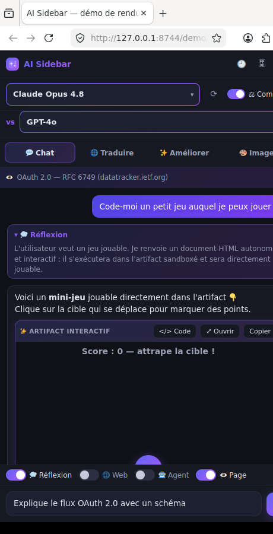

# AI Sidebar — IA multi-fournisseurs pour Firefox

Une extension Firefox **open-source** qui ajoute une **sidebar IA** à la manière de
[sider.ai](https://sider.ai), mais où **vous branchez votre propre IA** (BYOK) et
qui **interagit réellement avec la page et les onglets** — ce que la sidebar native
de Firefox ne permet pas. Un équivalent libre n'existait pas.

- 🎨 **Interface moderne** : thème sombre + dégradé bleu/violet, **boutons à
  bascule**, et un **sélecteur de modèle unifié** au-dessus du chat (une seule liste
  groupée par fournisseur connecté).
- 🔌 **Tous les fournisseurs** : **Claude** (Anthropic), **OpenAI**, **Gemini**,
  **Mistral**, **Groq**, **DeepSeek**, **OpenRouter**, et les **modèles locaux**
  **Ollama** / **LM Studio** (ou n'importe quel serveur compatible OpenAI via une
  URL personnalisée).
- 🔑 **Connexion par compte** : bouton **« Se connecter avec OpenRouter »** (OAuth
  PKCE — login Google / GitHub / email côté OpenRouter) qui débloque tous les
  modèles. Les autres fournisseurs utilisent une clé API (ils n'offrent pas d'OAuth).
- ⚖️ **Comparaison de modèles** : envoyez le même message à **deux modèles** et
  comparez leurs réponses côte à côte.
- 🧩 **Artifacts interactifs (façon Claude)** : demandez une app, un outil ou un
  **jeu** → l'IA renvoie un document HTML/JS (ou un composant **React/JSX**) qui
  s'exécute dans un aperçu sandboxé **et avec lequel vous interagissez/jouez**
  directement. (Mermaid/SVG pour les diagrammes.)
- 🕘 **Historique local** : vos conversations sont enregistrées **uniquement dans
  ce navigateur** (privacy) ; liste, rechargement, et « tout effacer ».
- 🗂 **Modes dédiés** (onglets façon Sider) : **💬 Chat**, **🌐 Traduire**,
  **✨ Améliorer**, **🎨 Image**. Le mode Améliorer propose des **styles d'écriture**
  (Marketing, Newsletter, Email pro, Post LinkedIn, Tweet, Blog, Académique…).
- 👁 **L'IA voit la page** : le contenu est lu automatiquement à l'ouverture d'un
  site **et à chaque navigation** (y compris changement de sous-domaine et
  navigations SPA), puis utilisé comme support pour répondre.
- 📑 **Lecture multi-onglets** : cochez plusieurs onglets ouverts pour les donner
  comme contexte à l'IA (comparer, synthétiser, recouper).
- ⚡ **Actions rapides** + **clic droit** : Résumer / Traduire la **page** ou la
  **sélection**, Expliquer, Améliorer, **Rédiger une réponse**.
- ✉️ **Réponse mail assistée** : sur les webmails (Gmail, Outlook, Proton, Yahoo),
  un bouton **« Répondre avec l'IA »** rédige un brouillon — **jamais d'envoi auto**.
- 💭 **Thinking** : le raisonnement du modèle (extended thinking de Claude,
  `reasoning` de DeepSeek / o-series) s'affiche dans un bloc repliable.
- 🎨 **Génération d'images** (endpoint compatible OpenAI `/images/generations`).
- 🤖 **Mode agent** : l'IA peut lire la page/les onglets, naviguer, cliquer,
  remplir des champs — avec **confirmation** des actions et un **garde-fou
  anti-achat** : elle peut remplir un panier mais **ne peut jamais payer/commander**.
- 🔒 **100% BYOK, zéro rétention serveur** : aucune clé fournie, **aucun serveur**,
  aucune télémétrie. Vos clés et données restent **locales** (`storage.local`),
  jamais synchronisées, envoyées uniquement à l'API que vous choisissez.

## Capture

Sidebar V1.1 — thème sombre + dégradé bleu/violet, sélecteur de modèle unifié,
boutons à bascule, comparaison de modèles, et un **artifact interactif jouable**
(un mini-jeu qui tourne dans l'aperçu sandboxé) — Firefox 152 :



> Capture générée via la page `demo/index.html` (reproduit la sidebar avec une
> réponse type), rendue dans Firefox sous Xvfb. Validé par `web-ext lint`
> (0 erreur ; les avertissements proviennent uniquement des libs vendorées).

## Installation (développement)

1. Ouvrir `about:debugging#/runtime/this-firefox`
2. **Charger un module complémentaire temporaire…**
3. Sélectionner `manifest.json` à la racine de ce dépôt
4. La sidebar s'ouvre via l'icône de la barre latérale ou `Ctrl+Shift+Y`
5. Cliquer ⚙ **Réglages** et renseigner **au moins une clé API** (ou pointer un
   modèle local Ollama / LM Studio, sans clé)

## Fournisseurs

| Fournisseur | Type | Clé requise | Notes |
|---|---|---|---|
| Claude (Anthropic) | natif | ✅ | thinking + recherche web |
| OpenAI | compatible OpenAI | ✅ | images (gpt-image-1 / DALL·E 3) |
| Google Gemini | compatible OpenAI | ✅ | endpoint `/v1beta/openai` |
| Mistral, Groq, DeepSeek | compatible OpenAI | ✅ | DeepSeek R1 = raisonnement |
| OpenRouter | compatible OpenAI | ✅ | catalogue géant, `⟳` pour lister |
| Ollama (local) | compatible OpenAI | ❌ | `http://localhost:11434/v1` |
| LM Studio (local) | compatible OpenAI | ❌ | `http://localhost:1234/v1` |
| Personnalisé | compatible OpenAI | optionnel | n'importe quelle URL `/v1` |

> Les serveurs locaux fonctionnent sans configuration CORS : l'extension dispose
> des *host permissions* et n'est donc pas soumise au CORS du navigateur.

## Architecture

```
manifest.json            MV3, sidebar_action (spécifique Firefox)
src/
  background/            Event page : menus contextuels (résumer/traduire/…)
  sidebar/               UI principale (chat, streaming, thinking, actions rapides)
  content/               Lecture page + actions DOM + notif. de navigation SPA
  options/               Réglages générés dynamiquement (clés BYOK par fournisseur)
  lib/
    models.js            Catalogue des fournisseurs + modèles + presets d'écriture
    providers.js         Client Anthropic natif + client générique OpenAI ; images
    agent.js             Boucle d'agent (tours modèle ↔ outils)
    tools.js             Outils navigateur (onglets, DOM) + exécuteur
    auth.js              Connexion OAuth (PKCE) OpenRouter via browser.identity
    history.js           Historique local des conversations (storage.local)
    storage.js           Réglages locaux (clés/modèles/URLs par fournisseur)
    markdown.js          Rendu Markdown + artifacts interactifs (HTML/JS, React, SVG, Mermaid)
```

### Détails techniques

- **MV3 / Firefox** : `sidebar_action` (équivalent Chrome : `side_panel`).
  Le background est un *event page* (`background.scripts`).
- **Un seul client pour presque tout** : la majorité des fournisseurs parlent le
  dialecte OpenAI (`/chat/completions`, `/models`, `/images/generations`). Un
  client générique paramétré par `baseUrl` + `apiKey` les couvre tous ; seul
  Anthropic a son client natif (extended thinking, recherche web serveur).
- **Anthropic depuis le navigateur** : header
  `anthropic-dangerous-direct-browser-access: true` + `x-api-key` +
  `anthropic-version: 2023-06-01`.
- **Les « yeux »** : la sidebar écoute `tabs.onActivated` / `tabs.onUpdated` et les
  notifications SPA du content script ; à chaque navigation elle relit la page,
  l'affiche dans un chip et l'injecte (mode chat) ou la laisse à l'agent (mode agent).
- **Thinking** : blocs `thinking` d'Anthropic (avec signature conservée pour rester
  valide au tour suivant) et `reasoning`/`reasoning_content` côté OpenAI/DeepSeek.

## Sécurité & confidentialité

- **Zéro rétention serveur** : l'extension n'a **aucun backend**. Aucune donnée
  (clés, conversations, contenu des pages) ne transite par un serveur tiers — tout
  reste dans le navigateur et n'est envoyé qu'à l'API IA que **vous** choisissez.
  Pas d'analytique, pas de télémétrie.
- Les clés API sont stockées via `browser.storage.local` (jamais synchronisées).
  **Aucune clé n'est fournie** : le dépôt est livré vierge.
- **Garde-fou anti-transaction** : en mode agent, les actions de
  paiement/commande/saisie de carte sont **refusées dans le code** (content script),
  pas seulement dans le prompt — un prompt détourné ne peut pas les contourner.
  L'agent s'arrête au panier.
- **Anti prompt-injection** : le contenu des pages, onglets et sélections est traité
  comme une **donnée non fiable**. Le prompt système interdit d'obéir à des
  instructions trouvées dans une page et de divulguer les clés/réglages.
- Le mode agent demande **confirmation** avant toute action modifiant l'état.
- **CSP stricte** sur les pages d'extension (`script-src 'self'`) ; les artifacts
  (HTML/JS/React/SVG/Mermaid) s'exécutent en **iframe sandboxée** (origine opaque,
  sans `allow-same-origin`), isolés de l'extension, des pages et des clés.
- **Historique 100% local** : les conversations sont stockées dans
  `storage.local` (jamais synchronisées) ; désactivable et effaçable dans les réglages.
- **Note artifacts React** : un artifact `jsx`/`react` charge React + Babel depuis
  un CDN public (`unpkg`) **à l'intérieur de l'iframe sandboxée uniquement**, et
  seulement quand un tel artifact est affiché. Les artifacts **HTML/JS** (jeux, apps)
  ne dépendent d'aucun CDN. La connexion OpenRouter passe par `browser.identity`.
- `anthropic-dangerous-direct-browser-access` expose la clé Anthropic au contexte
  navigateur de l'utilisateur (BYOK assumé) — acceptable car chacun fournit la sienne.

## Rendu Markdown & artifacts

Réponses rendues en **Markdown** (marked + DOMPurify, vendorés dans `vendor/`).
Blocs de code avec barre d'outils (**Copier**), et des **artifacts interactifs**
(façon Claude) dans des **iframes sandboxées**, avec bascule **Aperçu / Code** et
bouton **Ouvrir** (plein écran) :

- ` ```html ` → **app / jeu / outil** autonome, exécuté et **jouable** dans l'aperçu
- ` ```jsx ` (ou `react`) → **composant React** (définir `App`), transpilé en direct
- ` ```svg ` → graphique vectoriel rendu
- ` ```mermaid ` → diagramme rendu automatiquement

## Feuille de route

- [x] Multi-fournisseurs + modèles locaux (Ollama / LM Studio / custom)
- [x] Lecture auto de la page à chaque navigation (sous-domaine, SPA)
- [x] Lecture multi-onglets (sélection des onglets à donner en contexte)
- [x] Modes dédiés : Chat / Traduire / Améliorer / Image
- [x] Actions rapides + clic droit (page & sélection) + rédaction de réponse
- [x] Réponse mail assistée sur les webmails (sans envoi auto)
- [x] Mode agent avec garde-fou anti-achat (s'arrête au panier)
- [x] Thinking / raisonnement
- [x] Interface moderne (sombre + dégradé), sélecteur unifié, boutons à bascule
- [x] Connexion par compte (OAuth OpenRouter)
- [x] Comparaison de 2 modèles côte à côte
- [x] Artifacts interactifs façon Claude (HTML/JS jouable, React/JSX)
- [x] Historique de conversations local (privacy)
- [x] Styles d'écriture (marketing, newsletter, email, LinkedIn…)
- [ ] Capture d'écran d'onglet pour modèles vision
- [ ] Publication sur AMO — note aux relecteurs pour `vendor/mermaid.min.js`
      (lib minifiée ; son `Function` constructor ne s'exécute que dans l'iframe
      sandboxée, hors CSP de l'extension)

## Licence

MIT — voir [LICENSE](./LICENSE).
