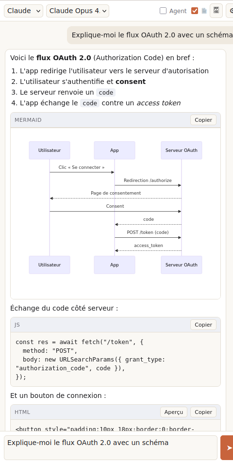
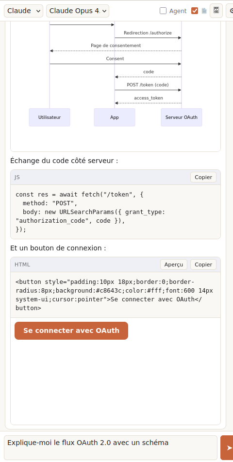

# AI Sidebar — Claude &amp; OpenRouter pour Firefox

Une extension Firefox qui ajoute une **sidebar IA** à la manière de [sider.ai](https://sider.ai),
mais qui **interagit réellement avec la page et les onglets** (ce que la sidebar
native de Firefox ne permet pas), avec un **mode agent** capable d'agir dans le
navigateur.

- 💬 **Chat** avec **Claude** (API Anthropic) et **OpenRouter** (GPT, Gemini, Llama, DeepSeek…)
- 📄 **Contexte de page** : la page consultée et la sélection sont injectées automatiquement
- 🤖 **Mode agent** : l'IA peut lire la page, lister/ouvrir/fermer des onglets,
  cliquer, remplir des champs, naviguer — avec **confirmation** des actions
- 🔑 **BYOK** (Bring Your Own Key) : vos clés API restent **locales** dans le navigateur

## Captures

Rendu Markdown + diagramme Mermaid, et aperçu d'un artifact HTML (bouton rendu
en direct dans une iframe sandboxée) — Firefox 152, vrai CSS + pipeline de rendu :

| Markdown + Mermaid | Artifact HTML (aperçu) |
|---|---|
|  |  |

> Captures générées via la page `demo/index.html` (reproduit la sidebar avec une
> réponse type), rendue dans Firefox sous Xvfb. Validé aussi par `web-ext lint`
> (0 erreur ; les avertissements proviennent uniquement de la lib mermaid bundlée).

## Installation (développement)

1. Ouvrir `about:debugging#/runtime/this-firefox`
2. **Charger un module complémentaire temporaire…**
3. Sélectionner `manifest.json` à la racine de ce dépôt
4. La sidebar s'ouvre via l'icône de la barre latérale ou `Ctrl+Shift+Y`
5. Cliquer ⚙ **Réglages** et renseigner au moins une clé API
   (Anthropic et/ou OpenRouter)

## Architecture

```
manifest.json            MV3, sidebar_action (spécifique Firefox)
src/
  background/            Event page minimal (menu contextuel)
  sidebar/               UI principale (chat, streaming, mode agent)
  content/               Lecture page + actions DOM (mode agent)
  options/               Réglages (clés BYOK, modèles, options)
  lib/
    providers.js         Clients Anthropic + OpenRouter (streaming SSE + tool-use)
    agent.js             Boucle d'agent (tours modèle ↔ outils)
    tools.js             Outils navigateur (onglets, DOM) + exécuteur
    storage.js           Stockage local des réglages
```

### Détails techniques

- **MV3 / Firefox** : on utilise `sidebar_action` (Firefox) — l'équivalent Chrome
  serait `side_panel`. Le background est un *event page* (`background.scripts`),
  plus fiable que le service worker pour le `fetch` streaming.
- **Anthropic depuis le navigateur** : header
  `anthropic-dangerous-direct-browser-access: true` pour autoriser le CORS,
  + `x-api-key` + `anthropic-version: 2023-06-01`.
- **OpenRouter** : API compatible OpenAI (`/chat/completions`), auth `Bearer`.
- **Modèles par défaut** : `claude-opus-4-8` (Anthropic), modèle OpenRouter au choix.
- **Mode agent** : outils définis en JSON Schema (`lib/tools.js`), adaptés au
  format natif de chaque provider (Anthropic `tools` / OpenAI `function`).
  Les actions d'écriture passent par une confirmation utilisateur.

## Sécurité & confidentialité

- Les clés API sont stockées via `browser.storage.local` (jamais synchronisées,
  jamais envoyées ailleurs que vers l'API choisie).
- Le mode agent demande confirmation avant toute action modifiant l'état
  (réglable dans les options).
- `anthropic-dangerous-direct-browser-access` expose la clé Anthropic au contexte
  navigateur de l'utilisateur (BYOK assumé) — acceptable ici car chacun fournit
  sa propre clé.

## Rendu Markdown &amp; artifacts

Les réponses sont rendues en **Markdown** (marked + DOMPurify, vendorés dans
`vendor/`). Les blocs de code ont une barre d'outils (langage + **Copier**), et
deux types d'**artifacts** s'affichent dans des **iframes sandboxées** (origine
opaque, isolées de l'extension et des pages, hors CSP) :

- ` ```mermaid ` → **diagramme** rendu automatiquement (mermaid v10 inliné)
- ` ```html ` / ` ```svg ` → bouton **Aperçu** (le HTML s'exécute en sandbox isolée)

La hauteur des iframes s'ajuste via `postMessage`.

## Feuille de route

- [x] Rendu Markdown des réponses
- [x] Artifacts (aperçu HTML/SVG, diagrammes Mermaid)
- [ ] Historique de conversations persistant
- [ ] Capture d'écran d'onglet pour modèles vision
- [ ] Publication sur AMO (addons.mozilla.org) — prévoir une note aux relecteurs
      pour `vendor/mermaid.min.js` (lib minifiée ; fournir source/version) ; le
      `Function` constructor de mermaid ne s'exécute que dans l'iframe sandboxée,
      hors CSP de l'extension

## Licence

MIT — voir [LICENSE](./LICENSE).
